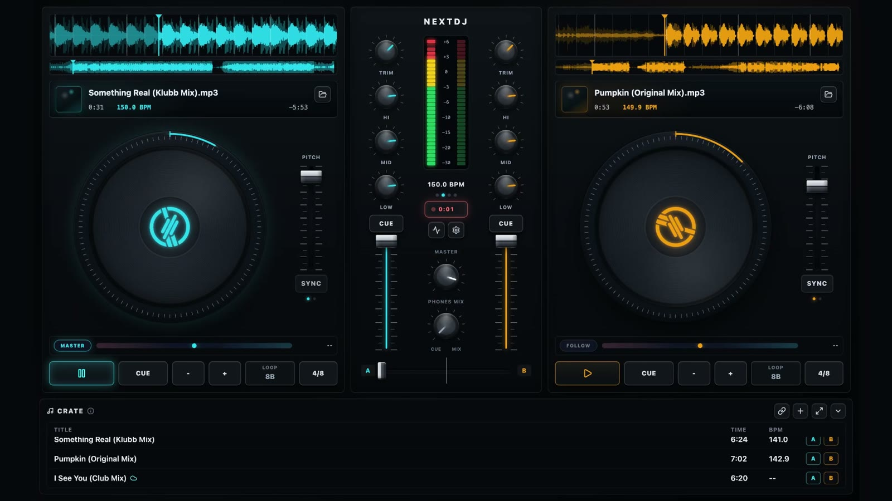

# NextDJ

NextDJ is an open-source desktop DJ console for local mixing. Load tracks from
your computer, inspect waveforms, control two decks, shape the mix, route output
devices, and record sessions from one focused desktop app.



## What You Can Do

- Mix with two local audio decks.
- View overview and zoom waveforms.
- Control pitch, cue, loops, hot cues, sync, and jog wheels.
- Shape channels with gain, EQ, filters, faders, crossfader, and VU meters.
- Choose output devices where the platform supports it.
- Record sessions from the app.
- Add optional playlist import providers through a local plugin API.

## Status

NextDJ is early software. The repository is public and usable for development,
testing, and feedback, but the first downloadable builds are unsigned
pre-releases.

macOS and Windows may show security warnings or require an extra confirmation
before opening the app. If you prefer to inspect everything first, build from
source.

## Downloads

GitHub Releases are configured to publish:

- macOS x64/arm64: `.dmg` and `.zip`
- Windows x64: installer and portable `.exe`
- Linux x64: `.AppImage` and `.deb`
- `SHA256SUMS.txt` for artifact verification

No release has to be created to run the app locally.

## Run From Source

```bash
npm install
npm run dev
```

Use npm for this repository because `package-lock.json` is committed.

## Build Locally

```bash
npm run build
npm run dist:mac
npm run dist:win
npm run dist:linux
```

Generate checksums for local release artifacts:

```bash
npm run release:checksums
```

See [docs/RELEASING.md](docs/RELEASING.md) before publishing downloadable
builds.

## Playlist Import Plugins

NextDJ ships without service-specific playlist importers. External playlist
support is provider-based and runs in the Electron main process, not in the
renderer.

See [docs/PLAYLIST_PLUGINS.md](docs/PLAYLIST_PLUGINS.md) for the neutral plugin
API. Providers are responsible for only importing content that the user has the
right to access, copy, and use.

## Development

Useful checks:

```bash
npm run lint
npm run typecheck
npm run test
npm run test:coverage
npm run check
```

`npm run check` runs lint, typecheck, unit tests, and the production build.

The app is structured around:

- `src/main`: Electron lifecycle, IPC, recording writes, and playlist provider loading.
- `src/preload`: the stable `window.nextdj` bridge.
- `src/shared`: types shared across main, preload, and renderer.
- `src/renderer/src/audio`: WebAudio engine, decks, mixer, output routing, BPM, and persistence.
- `src/renderer/src/components`: decks, mixer, library, settings, waveforms, and controls.
- `src/renderer/src/hooks`: React orchestration around app workflows.

## Contributing

Read [CONTRIBUTING.md](CONTRIBUTING.md) before opening a pull request. Security
reports should follow [SECURITY.md](SECURITY.md).

## License

NextDJ is released under the [MIT License](LICENSE).
